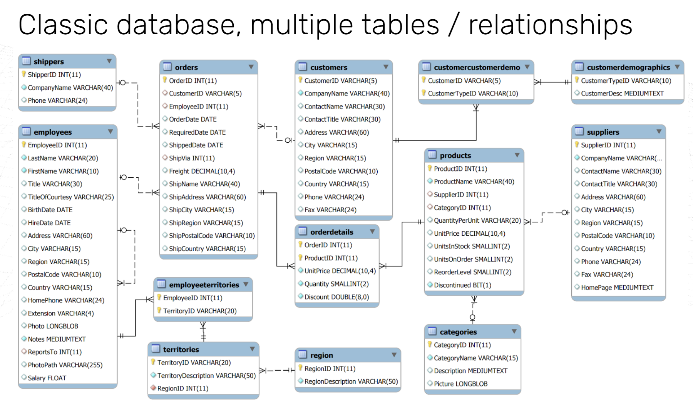
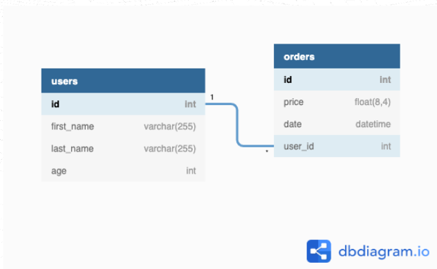
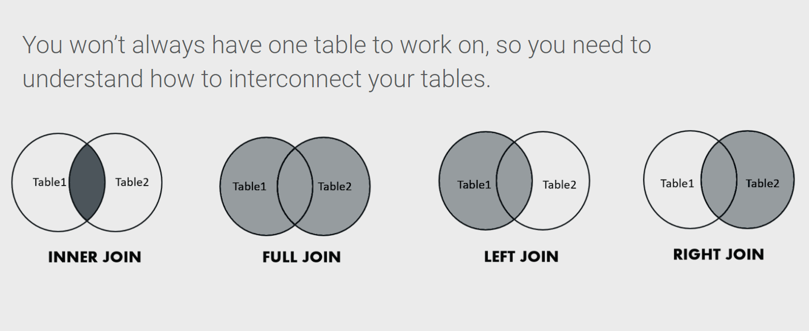

<!DOCTYPE html>
<html lang="en">
<head>
<meta charset="UTF-8" />
<meta name="viewport" content="width=device-width, initial-scale=1.0" />
<link rel="stylesheet" href="../styles/styles.css" />
<title>SQL</title>
</head>
<body>
<header class="header">
<h1>SQL (Structured Query Language)</h1>
</header>
<nav class="nav">
<ul class="nav__list">
<li><a href="#SQLSchema">SQL Schema</a></li>
<li><a href="#RelationalSQL">Relational SQL</a></li>
<li><a href="#connectingTables">Connecting Tables</a></li>
<li><a href="#MoreToJOIN">More To JOIN</a></li>
</ul >
</nav>

<main class="main">
<section>
<strong id="SQLSchema">SQL Schema</strong>
<ul>
<li>

### Data Modeling and Structuring

- Medium to large companies have databases that are co-created by multiple people.
  <br> each database consists of many tables



</li>
</ul>
</section>

<section>
<strong id="RelationalSQL">Relational Database</strong>
<ul>
<li>

### Relational tables in SQL

1. Assuming we are building an ECommerce website.
   <br> we need at least one database that stores information about mainly purchase orders, and users.

- Users table:

<div class="container">

```sql
CREATE TABLE users (
    id serial  PRIMARY KEY,
    first_name varchar(255),
    last_name varchar(255),
    age int
);
```

<table>
<thead>
    <tr>
      <th class="th">ID</th>
      <th class="th">first_name</th>
      <th class="th">last_name</th>
      <th class="th">Age</th>
    </tr>
  </thead>
  <tbody>
    <tr>
      <td class="td">1</td>
      <td class="td">John</td>
      <td class="td">Doe</td>
      <td class="td">18</td>
    </tr>
    <tr>
      <td class="td">2</td>
      <td class="td">Bob</td>
      <td class="td">Dylan</td>
      <td class="td">30</td>
    </tr>
    <tr>
      <td class="td">3</td>
      <td class="td">Jane</td>
      <td class="td">Doe</td>
      <td class="td">25</td>
    </tr>
  </tbody>
</table>
</div>

- Orders table:

<div class="container">

```sql
CREATE TABLE orders (
    id serial PRIMARY KEY,
    price float,
  	date timestamp,
);
```

<table class="orders">
<thead>
    <tr>
      <th class="th">ID</th>
      <th class="th">Price</th>
      <th class="th">Date</th>
    </tr>
  </thead>
  <tbody>
    <tr>
      <td class="td">1</td>
      <td class="td">18</td>
      <td class="td">2001-01-01 00:00Z:00</td>
    </tr>
    <tr>
      <td class="td">2</td>
      <td class="td">112</td>
      <td class="td">2001-01-02 04:00:00Z</td>
    </tr>
    <tr>
      <td class="td">3</td>
      <td class="td">9</td>
      <td class="td">2001-01-04 05:00:00Z</td>
    </tr>
    <tr>
      <td class="td">4</td>
      <td class="td">14.5</td>
      <td class="td">2001-01-03 05:00:00Z</td>
    </tr>
  </tbody>
</table>
</div>

2. but there is no way to know who bought what!

- we can simply add the name of the person how purchased the order as a new column in our table Orders :

<div class="container">

<table>
<thead>
    <tr>
      <th class="th">ID</th>
      <th class="th">first_name</th>
      <th class="th">last_name</th>
      <th class="th">Age</th>
    </tr>
  </thead>
  <tbody>
    <tr>
      <td class="td">1</td>
      <td class="td specific">John</td>
      <td class="td">Doe</td>
      <td class="td">18</td>
    </tr>
    <tr>
      <td class="td">2</td>
      <td class="td specific">Bob</td>
      <td class="td">Dylan</td>
      <td class="td">30</td>
    </tr>
    <tr>
      <td class="td">3</td>
      <td class="td specific">Jane</td>
      <td class="td">Doe</td>
      <td class="td">25</td>
    </tr>
  </tbody>
</table>

<table class="orders">
<thead>
    <tr>
      <th class="th">ID</th>
      <th class="th">Price</th>
      <th class="th">Date</th>
      <th class="th">User</th>
    </tr>
  </thead>
  <tbody>
    <tr>
      <td class="td">1</td>
      <td class="td">18</td>
      <td class="td">2001-01-01 00:00Z:00</td>
      <td class="td specific">John</td>
    </tr>
    <tr>
      <td class="td">2</td>
      <td class="td">112</td>
      <td class="td">2001-01-02 04:00:00Z</td>
      <td class="td specific">John</td>
    </tr>
    <tr>
      <td class="td">3</td>
      <td class="td">9</td>
      <td class="td">2001-01-04 05:00:00Z</td>
      <td class="td specific">Bob</td>
    </tr>
    <tr>
      <td class="td">4</td>
      <td class="td">14.5</td>
      <td class="td">2001-01-03 05:00:00Z</td>
      <td class="td specific">Jane</td>
    </tr>
  </tbody>
</table>
</div>

- but what if in the future another John joined up?
  <br>To avoid this confusion, it is better to use the user ID instead of the name

<div class="container">

<table>
<thead>
    <tr>
      <th class="th">ID</th>
      <th class="th">first_name</th>
      <th class="th">last_name</th>
      <th class="th">Age</th>
    </tr>
  </thead>
  <tbody>
    <tr>
      <td class="td specific">1</td>
      <td class="td">John</td>
      <td class="td">Doe</td>
      <td class="td">18</td>
    </tr>
    <tr>
      <td class="td specific">2</td>
      <td class="td">Bob</td>
      <td class="td">Dylan</td>
      <td class="td">30</td>
    </tr>
    <tr>
      <td class="td specific">3</td>
      <td class="td">Jane</td>
      <td class="td">Doe</td>
      <td class="td">25</td>
    </tr>
  </tbody>
</table>

<table class="orders">
<thead>
    <tr>
      <th class="th">ID</th>
      <th class="th">Price</th>
      <th class="th">Date</th>
      <th class="th">User_Id</th>
    </tr>
  </thead>
  <tbody>
    <tr>
      <td class="td">1</td>
      <td class="td">18</td>
      <td class="td">2001-01-01 00:00Z:00</td>
      <td class="td specific">1</td>
    </tr>
    <tr>
      <td class="td">2</td>
      <td class="td">112</td>
      <td class="td">2001-01-02 04:00:00Z</td>
      <td class="td specific">1</td>
    </tr>
    <tr>
      <td class="td">3</td>
      <td class="td">9</td>
      <td class="td">2001-01-04 05:00:00Z</td>
      <td class="td specific">2</td>
    </tr>
    <tr>
      <td class="td">4</td>
      <td class="td">14.5</td>
      <td class="td">2001-01-03 05:00:00Z</td>
      <td class="td specific">3</td>
    </tr>
  </tbody>
</table>
</div>

3. To achieve that in SQL:

- We need to add a User_Id column, when creating the orders table.
- this User_ID wil be a reference to a specific user from users table.
- <b>FOREIGN KEY (user_id)</b> indicates that this column is a references to external table.
- <b>REFERENCES table(id)</b> refers to the specific user from that external table by using the id.

4. final result should look like this:

- Users table:

<div class="container">

```sql
CREATE TABLE users (
    id serial  PRIMARY KEY,
    first_name varchar(255),
    last_name varchar(255),
    age int
);
```

<table>
<thead>
    <tr>
      <th class="th">ID</th>
      <th class="th">first_name</th>
      <th class="th">last_name</th>
      <th class="th">Age</th>
    </tr>
  </thead>
  <tbody>
    <tr>
      <td class="td specific">1</td>
      <td class="td">John</td>
      <td class="td">Doe</td>
      <td class="td">18</td>
    </tr>
    <tr>
      <td class="td specific">2</td>
      <td class="td">Bob</td>
      <td class="td">Dylan</td>
      <td class="td">30</td>
    </tr>
    <tr>
      <td class="td specific">3</td>
      <td class="td">Jane</td>
      <td class="td">Doe</td>
      <td class="td">25</td>
    </tr>
  </tbody>
</table>
</div>

- Orders table:

<div class="container">

```sql
CREATE TABLE orders (
    id serial PRIMARY KEY,
    price float,
  	date timestamp,
  	user_id int,
    FOREIGN KEY (user_id) REFERENCES users(id)
);
```

<table class="orders">
<thead>
    <tr>
      <th class="th">ID</th>
      <th class="th">Price</th>
      <th class="th">Date</th>
      <th class="th">User_Id</th>
    </tr>
  </thead>
  <tbody>
    <tr>
      <td class="td">1</td>
      <td class="td">18</td>
      <td class="td">2001-01-01 00:00Z:00</td>
      <td class="td specific">1</td>
    </tr>
    <tr>
      <td class="td">2</td>
      <td class="td">112</td>
      <td class="td">2001-01-02 04:00:00Z</td>
      <td class="td specific">1</td>
    </tr>
    <tr>
      <td class="td">3</td>
      <td class="td">9</td>
      <td class="td">2001-01-04 05:00:00Z</td>
      <td class="td specific">2</td>
    </tr>
    <tr>
      <td class="td">4</td>
      <td class="td">14.5</td>
      <td class="td">2001-01-03 05:00:00Z</td>
      <td class="td specific">3</td>
    </tr>
  </tbody>
</table>
</div>



<a href="https://www.db-fiddle.com/f/oDar5WXtmyLWs3hGLCuTek/179"> Practice Here! </a>

5. when inserting a new order, make sure to add the user_id

```sql
INSERT INTO orders (price,date, user_id)
VALUES ( 18, '2001-01-01 00:00Z:00', 1);
       ( 112, '2001-01-02 04:00:00Z', 1);
       ( 9, '2001-01-04 05:00:00Z', 2);
       ( 14.5 , '2001-01-03 05:00:00Z', 3)
```

</li>
</ul>
</section>
<section>
<strong id="connectingTables">Connecting Tables</strong>
<ul>
<li>

### joining tables

1. we managed to create two tables users and orders, but how can that be beneficial?

- so if we want to know all the orders made by John.
  - we need to <b>SELECT</b> every column from the table orders.
  - then filter out the ones <b>WHERE</b> the user_id is John's id.

```sql
SELECT *
FROM orders
WHERE user_id = 1;
```

orders table:
<br>

<table class="orders">
<thead>
    <tr>
      <th class="th">ID</th>
      <th class="th">Price</th>
      <th class="th">Date</th>
      <th class="th">User_Id</th>
    </tr>
  </thead>
  <tbody>
    <tr>
      <td class="td">1</td>
      <td class="td">18</td>
      <td class="td">2001-01-01 00:00Z:00</td>
      <td class="td">1</td>
    </tr>
    <tr>
      <td class="td">2</td>
      <td class="td">112</td>
      <td class="td">2001-01-02 04:00:00Z</td>
      <td class="td">1</td>
    </tr>
  </tbody>
</table>

2. Although this works, but it would be even better to join the user data who made those orders to the previous result.

- we can do that be using <b>JOIN ON</b>

```sql
SELECT *
FROM orders INNER JOIN users
ON orders.user_id = users.id
WHERE user_id = 1;
```

Joined table:
<br>

<table class="joined">
<thead>
    <tr>
      <th class="th">ID</th>
      <th class="th">Price</th>
      <th class="th">Date</th>
      <th class="th">User_Id</th>
      <th class="th">ID</th>
      <th class="th">first_name</th>
      <th class="th">last_name</th>
      <th class="th">Age</th>
    </tr>
  </thead>
  <tbody>
    <tr>
      <td class="td">1</td>
      <td class="td">18</td>
      <td class="td">2001-01-01 00:00:00Z</td>
      <td class="td">1</td>
      <td class="td">1</td>
      <td class="td">John</td>
      <td class="td">Doe</td>
      <td class="td">18</td>
    </tr>
    <tr>
      <td class="td">2</td>
      <td class="td">112</td>
      <td class="td">2001-01-02 04:00:00Z</td>
      <td class="td">1</td>
      <td class="td">1</td>
      <td class="td">John</td>
      <td class="td">Doe</td>
      <td class="td">18</td>
    </tr>
  </tbody>
</table>

- in other words, we will get an object to the front end like this:

```js
const JohnOrders = [
  {
    id: 1,
    price: 18,
    date: '2001-01-01 00:00:00Z',
    user_id: 1,
    id: 1,
    first_name: 'John',
    last_name: 'Doe',
    age: 18,
  },
  {
    id: 2,
    price: 112,
    date: '2001-01-02 04:00:00Z',
    user_id: 1,
    id: 1,
    first_name: 'John',
    last_name: 'Doe',
    age: 18,
  },
];
```

- it allows us to connect data from both tables together in meaningful ways.
  <br> for example, knowing which user made an order or what price was on a certain date

</li>
</ul>
</section>

<section>
<strong id="MoreToJOIN">More To JOIN</strong>
<ul>

<li>

### JOIN types



1. <b>FULL JOIN</b>

- So far every user has made at least one order.
  <br> but what if one of the users did not purchase any orders?

```sql
INSERT INTO users (id, first_name, last_name, age)
VALUES (4, 'Gorge', 'Orwell', NULL);
```

- and what if on of the orders did not have an id?

```sql
INSERT INTO orders (price, date, user_id)
VALUES ( 100 , '2001-01-05 05:00:00', NULL);
```

- FULL JOIN will returns all records.

```sql
SELECT *
FROM orders FULL JOIN users
ON orders.user_id = users.id;
```

<br>
<table class="joined" >
<thead>
    <tr>
      <th class="th">ID</th>
      <th class="th">Price</th>
      <th class="th">Date</th>
      <th class="th">User_Id</th>
      <th class="th">ID</th>
      <th class="th">first_name</th>
      <th class="th">last_name</th>
      <th class="th">Age</th>
    </tr>
  </thead>
<tbody>
    <tr>
      <td class="td">1</td>
      <td class="td">18</td>
      <td class="td">2001-01-01T00:00:00.000Z</td>
      <td class="td">1</td>
      <td class="td">1</td>
      <td class="td">John</td>
      <td class="td">Doe</td>
      <td class="td">18</td>
    </tr>
    <tr>
      <td class="td">2</td>
      <td class="td">112</td>
      <td class="td">2001-01-02T04:00:00.000Z</td>
      <td class="td">1</td>
      <td class="td">1</td>
      <td class="td">John</td>
      <td class="td">Doe</td>
      <td class="td">18</td>
    </tr>
    <tr>
      <td class="td">3</td>
      <td class="td">9</td>
      <td class="td">2001-01-04T05:00:00.000Z</td>
      <td class="td">2</td>
      <td class="td">2</td>
      <td class="td">Bob</td>
      <td class="td">Dylan</td>
      <td class="td">30</td>
    </tr>
    <tr>
      <td class="td">4</td>
      <td class="td">14.5</td>
      <td class="td">2001-01-03T05:00:00.000Z</td>
      <td class="td">3</td>
      <td class="td">3</td>
      <td class="td">Jane</td>
      <td class="td">Doe</td>
      <td class="td">25</td>
    </tr>
    <tr>
      <td class="td">5</td>
      <td class="td">100</td>
      <td class="td">2001-01-05T05:00:00.000Z</td>
      <td class="td">NULL</td>
      <td class="td">NULL</td>
      <td class="td">NULL</td>
      <td class="td">NULL</td>
      <td class="td">NULL</td>
    </tr>
    <tr>
      <td class="td">NULL</td>
      <td class="td">NULL</td>
      <td class="td">NULL</td>
      <td class="td">NULL</td>
      <td class="td">4</td>
      <td class="td">Gorge</td>
      <td class="td">Orwell</td>
      <td class="td">NULL</td>
    </tr>
    </tbody>
  </table>

2. <b>INNER JOIN</b>

- return only records when there is a match in both left and right tables.

```sql
SELECT *
FROM orders INNER JOIN users
ON orders.user_id = users.id;
```

<br>
<table class="joined" >
<thead>
    <tr>
      <th class="th">ID</th>
      <th class="th">Price</th>
      <th class="th">Date</th>
      <th class="th">User_Id</th>
      <th class="th">ID</th>
      <th class="th">first_name</th>
      <th class="th">last_name</th>
      <th class="th">Age</th>
    </tr>
  </thead>
<tbody>
    <tr>
      <td class="td">1</td>
      <td class="td">18</td>
      <td class="td">2001-01-01T00:00:00.000Z</td>
      <td class="td">1</td>
      <td class="td">1</td>
      <td class="td">John</td>
      <td class="td">Doe</td>
      <td class="td">18</td>
    </tr>
    <tr>
      <td class="td">2</td>
      <td class="td">112</td>
      <td class="td">2001-01-02T04:00:00.000Z</td>
      <td class="td">1</td>
      <td class="td">1</td>
      <td class="td">John</td>
      <td class="td">Doe</td>
      <td class="td">18</td>
    </tr>
    <tr>
      <td class="td">3</td>
      <td class="td">9</td>
      <td class="td">2001-01-04T05:00:00.000Z</td>
      <td class="td">2</td>
      <td class="td">2</td>
      <td class="td">Bob</td>
      <td class="td">Dylan</td>
      <td class="td">30</td>
    </tr>
    <tr>
      <td class="td">4</td>
      <td class="td">14.5</td>
      <td class="td">2001-01-03T05:00:00.000Z</td>
      <td class="td">3</td>
      <td class="td">3</td>
      <td class="td">Jane</td>
      <td class="td">Doe</td>
      <td class="td">25</td>
    </tr>
    </tbody>
  </table>

3. <b>LEFT JOIN</b>

- return all records from the left table ("orders"), and the matched records from the right table ("users").

```sql
SELECT *
FROM orders LEFT JOIN users
ON orders.user_id = users.id;
```

<br>
<table class="joined" >
<thead>
    <tr>
      <th class="th">ID</th>
      <th class="th">Price</th>
      <th class="th">Date</th>
      <th class="th">User_Id</th>
      <th class="th">ID</th>
      <th class="th">first_name</th>
      <th class="th">last_name</th>
      <th class="th">Age</th>
    </tr>
  </thead>
<tbody>
    <tr>
      <td class="td">1</td>
      <td class="td">18</td>
      <td class="td">2001-01-01T00:00:00.000Z</td>
      <td class="td">1</td>
      <td class="td">1</td>
      <td class="td">John</td>
      <td class="td">Doe</td>
      <td class="td">18</td>
    </tr>
    <tr>
      <td class="td">2</td>
      <td class="td">112</td>
      <td class="td">2001-01-02T04:00:00.000Z</td>
      <td class="td">1</td>
      <td class="td">1</td>
      <td class="td">John</td>
      <td class="td">Doe</td>
      <td class="td">18</td>
    </tr>
    <tr>
      <td class="td">3</td>
      <td class="td">9</td>
      <td class="td">2001-01-04T05:00:00.000Z</td>
      <td class="td">2</td>
      <td class="td">2</td>
      <td class="td">Bob</td>
      <td class="td">Dylan</td>
      <td class="td">30</td>
    </tr>
    <tr>
      <td class="td">4</td>
      <td class="td">14.5</td>
      <td class="td">2001-01-03T05:00:00.000Z</td>
      <td class="td">3</td>
      <td class="td">3</td>
      <td class="td">Jane</td>
      <td class="td">Doe</td>
      <td class="td">25</td>
    </tr>
    <tr>
      <td class="td">5</td>
      <td class="td">100</td>
      <td class="td">2001-01-05T05:00:00.000Z</td>
      <td class="td">NULL</td>
      <td class="td">NULL</td>
      <td class="td">NULL</td>
      <td class="td">NULL</td>
      <td class="td">NULL</td>
    </tr>
    </tbody>
  </table>

4. <b>RIGHT JOIN</b>

- return all records from the right table and the matched records from the left table. RIGHT JOIN is also known as OUTER JOIN.

```sql
SELECT *
FROM users RIGHT JOIN orders
ON users.id = orders.id;
```

<br>
<table class="joined" >
<thead>
    <tr>
      <th class="th">ID</th>
      <th class="th">Price</th>
      <th class="th">Date</th>
      <th class="th">User_Id</th>
      <th class="th">ID</th>
      <th class="th">first_name</th>
      <th class="th">last_name</th>
      <th class="th">Age</th>
    </tr>
  </thead>
<tbody>
    <tr>
      <td class="td">1</td>
      <td class="td">18</td>
      <td class="td">2001-01-01T00:00:00.000Z</td>
      <td class="td">1</td>
      <td class="td">1</td>
      <td class="td">John</td>
      <td class="td">Doe</td>
      <td class="td">18</td>
    </tr>
    <tr>
      <td class="td">2</td>
      <td class="td">112</td>
      <td class="td">2001-01-02T04:00:00.000Z</td>
      <td class="td">1</td>
      <td class="td">1</td>
      <td class="td">John</td>
      <td class="td">Doe</td>
      <td class="td">18</td>
    </tr>
    <tr>
      <td class="td">3</td>
      <td class="td">9</td>
      <td class="td">2001-01-04T05:00:00.000Z</td>
      <td class="td">2</td>
      <td class="td">2</td>
      <td class="td">Bob</td>
      <td class="td">Dylan</td>
      <td class="td">30</td>
    </tr>
    <tr>
      <td class="td">4</td>
      <td class="td">14.5</td>
      <td class="td">2001-01-03T05:00:00.000Z</td>
      <td class="td">3</td>
      <td class="td">3</td>
      <td class="td">Jane</td>
      <td class="td">Doe</td>
      <td class="td">25</td>
    </tr>
    <tr>
      <td class="td">NULL</td>
      <td class="td">NULL</td>
      <td class="td">NULL</td>
      <td class="td">NULL</td>
      <td class="td">4</td>
      <td class="td">Gorge</td>
      <td class="td">Orwell</td>
      <td class="td">NULL</td>
    </tr>
    </tbody>
  </table>

</li>
</ul>
</section>

</main>
</body>
</html>
