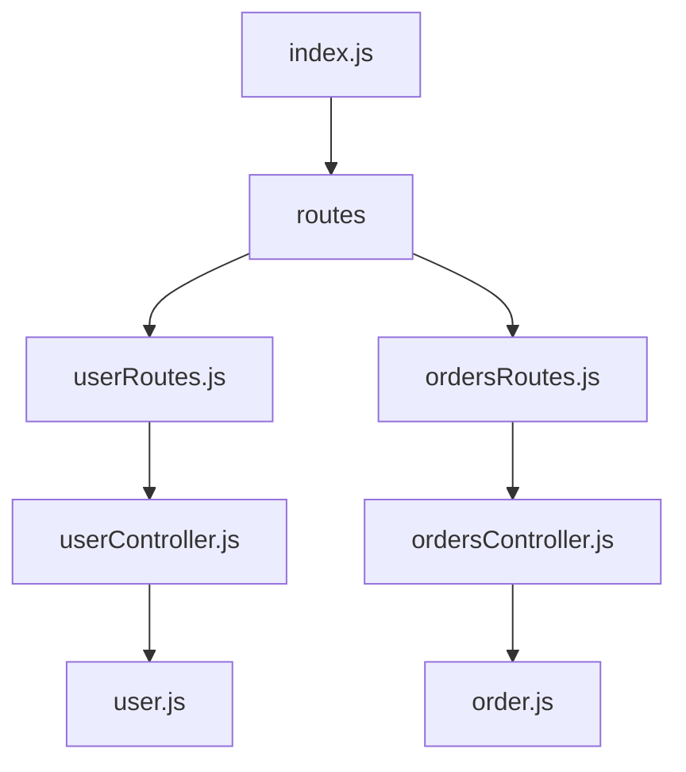
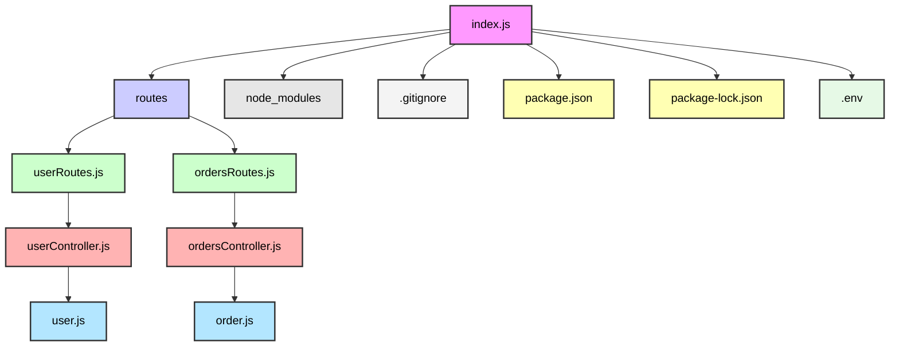

# Project Name

## Description

This project is a simple Node.js backend API built with Express.js and Sequelize for handling user and order data. The API includes routes for user and order management, with functionality to create, read, update, and delete users and orders. It also demonstrates how to set up a connection to a database and handle routing between controllers and models.

## Prerequisites

Before running the project, make sure you have the following installed:

- Node.js (LTS version)
- npm (Node Package Manager)
- A relational database (e.g., PostgreSQL, MySQL, SQLite)

## Setup

### 1. Clone the repository

```bash
git clone <repository_url>
cd <project_directory>
```

2. Create .env file
   In the project root directory, create a .env file and add the following environment variables:
   PORT=8080
   DATABASE_URL=your_database_connection_string_here

3. Install dependencies
   Run the following command to install the necessary dependencies:

npm install

4. Run the application
   To start the server in development mode, run:

npm run dev

5. Project Structure
   The project is organized in the following way:

```
/project-root
  ├── /controllers
  │    ├── userController.js
  │    └── ordersController.js
  ├── /models
  │    ├── index.js
  │    ├── user.js
  │    └── order.js
  ├── /routes
  │    ├── userRoutes.js
  │    └── ordersRoutes.js
  ├── .gitignore
  ├── package.json
  ├── package-lock.json
  ├── index.js
  └── node_modules/


```





API Endpoints
User Routes
GET /users: Get all users.

GET /users/:id: Get a user by ID.

POST /users: Create a new user.

PUT /users/:id: Update a user by ID.

DELETE /users/:id: Delete a user by ID.

Order Routes
GET /orders: Get all orders.

GET /orders/order/:id: Get an order by ID.

POST /orders: Create a new order.

PUT /orders/order/:id: Update an order by ID.

DELETE /orders/order/:id: Delete an order by ID.

JOIN Routes
GET /orders/inner-join: Get users who have placed orders.

GET /orders/left-join: Get all users, even those without orders.

GET /orders/right-join: Get all orders, even those without users.

GET /orders/full-join: Get a full outer join of users and orders (simulated).
